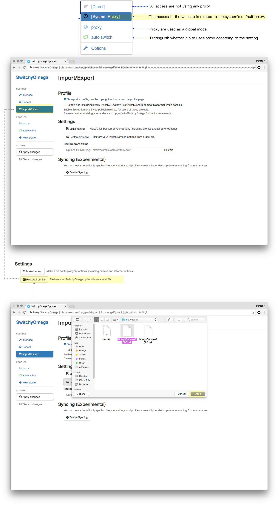

# Chrome + Proxy SwitchyOmega Settings

**It is assumed that you have already configured the Shadowsocks client. For details, please refer to**

* [Shadowsocks Setup Guide (Windows)](2-windows-setup-guide-en.md)

* [Shadowsocks Setup Guide (macOS)](3-macos-setup-guide-en.md)

**This article does not apply to Chrome on any mobile phone.**

## Install Extensions

* You can install [Proxy SwitchyOmega](https://chrome.google.com/webstore/detail/padekgcemlokbadohgkifijomclgjgif) extension from the Chrome Store.

* If you can't access it, you can also download the .crx file directly at [Github](https://github.com/FelisCatus/SwitchyOmega/releases) and drag to `chrome://extensions/`. (Please copy and paste this link to Google Chrome and press enter)

## Extended configuration

* **(Recommended)** You can use the backup configuration file which is already provided on our website.

* Download the configuration file for SwitchyOmega via the link below.

* Windows/Linux/macOS (ShadowsocksX): [SwitchOmega + GFWList auto-switch configuration file [1080]](https://portal.shadowsocks.nu/dl.php?type=d&id=74)  
> (For Shadowsocks-Windows / Linux / ShadowsocksX (macOS) and other clients that the default port is 1080 .)

* macOS: [SwitchOmega + GFWList auto-switch configuration file [1086]](https://portal.shadowsocks.nu/dl.php?type=d&id=75)  
>(Applies to ShadowscoksX-NG, the default port is 1086.)

* Click Proxy "SwitchyOmega" > "Options" > "Import/Export" > "Restore from File".
* Select the profile file you just downloaded > "Open".
Click the "Switchyomega" icon, and you will see the following four modes:

* Direct: All access are not using any proxy.

* System Proxy: The access to the website is related to the system's default proxy.

* Proxy: proxy are used as a global mode.

* Auto switching: Distinguish whether a site uses proxy according to the setting.  
> The configuration provided by our website uses "GFWList", which allows most websites that cannot be accessed directly in China to use the proxy by default. It is recommended for daily use in China.

## Custom Rules

* Click "Auto Switch" > "Add a rule list".  

>* Condition type: "Host wildcard".  

>* Fill in the condition settings: "*.domain name".  

>* Profile: Select "proxy" to **go through the proxy**, select "Direct" to **not go through the proxy**.

